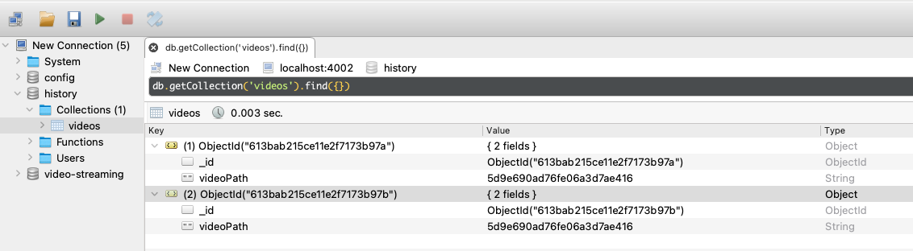

### LOG430 
#### Microservices (version local sans l'utilisation d'azure)

</img>

<hr>

## Configuration de votre ordinateur

- [Installer GIT](https://git-scm.com/downloads)
- [Intaller Node et npm](https://docs.npmjs.com/downloading-and-installing-node-js-and-npm)
- [Installer Robo 3T](https://robomongo.org )
- [Installer Docker](https://www.docker.com/products/docker-desktop)
- [Installer Docker-compose](https://docs.docker.com/get-started/08_using_compose/)
- <s>[Installer Kubectl](https://kubernetes.io/docs/tasks/tools/)</s>
- <s>[Installer Kink](https://kind.sigs.k8s.io/docs/user/quick-start/)</s>
- <s>[Installer Minikube](https://minikube.sigs.k8s.io/docs/start/)</s>
- [Installer ngrok](https://ngrok.com/download)
- Récupérer les sources de l'exercice
```code
git clone https://github.com/yvanross/log430-exercice-microservice-sans-azure
```
<hr>

## Un exemple d'application

<!-- {.plain}{width=75%} -->
>

<hr>

<!-- id="mon-premier-microservice" -->
## Mon premier microservice
```bash
cd log430-exercice-microservice-sans-azure # base application directory that contain all microservices project
cd video-storage
npm init -y
npm install --save express
npm install --save-dev nodemon // live reload for fast iteration
```
### Code du microservice
<a href="video-storage/src/index.js">video-storage/src/index.js</a>

<hr>

## Vidéo à envoyer en stream
  - Voir [SampleVideo_1280x720_1mb.mp4](assets/SampleVideo_1280x720_1mb.mp4)

<hr>

## Test de votre microservice
Commandes bash pour spécifier le port à utiliser
```
export PORT=3000 # mac
set PORT=3000 # windows
```

Une de ses commandes pour démarrer le microservice
```
npm start 
npm run start:dev # utilise nodemon pour faire un live reload 
```

Tester votre microservice avec Chrome
```
# Ne fonctionne pas avec Safari
http://localhost:3000/video?path=SampleVideo_1280x720_1mb.mp4  # pour voir votre vidéo.
```

Félicitation vous venez d'exécuter votre premier microservice

<hr>
## Configuration de Docker pour video-storage
[video-storage/Dockerfile](video-storage/Dockerfile)

## Docker build/run command
```
docker build -t video-storage --file Dockerfile .
docker image list
docker run -p 3000:3000 --env PORT=3000 video-storage
# docker run -d -p 3000:3000 video-storage  # en mode détaché
```

<hr>

## Tester votre microservice video-storage avec Chrome
```
# Ne fonctionne pas avec Safari
http://localhost:3000/video?path=SampleVideo_1280x720_1mb.mp4  # pour voir votre vidéo.
```

Félicitation vous avez un premier microservice déployé avec docker

<hr>

## Nettoyer votre désordre
```
docker ps # List all containers (running and stopped)
docker kill <container-id>  # stop a  container locally
docker rm <container-id>  #remove a container locally 
docker rmi <your-image-id> --force   # Remove a particular image  
```

<hr>

### Créer le microservice video-streaming

```
cd video-streaming
npm install # installer tout les autres dépendances
```

<hr>

#### Création de plusieur microservices avec docker-compose
[docker-compose.yml](docker-compose.yml)

### Démarrer les microservices
#### video-storage et video-streaming
```
docker-compose down && docker-compose up --build
# test video-storage
http://localhost:4000/video?path=SampleVideo_1280x720_1mb.mp4 
# test video-streaming
http://localhost:4001/video?path=SampleVideo_1280x720_1mb.mp4 


ctrl-c # (une seule fois) pour terminer l'instance docker-compose
```

<hr>

## Ajout d'une base de donnée MongoDB
```
# npm install --prefix ./video-streaming --save mongodb # déja fait
docker-compose  -f docker-compose-db.yml down && docker-compose -f docker-compose-db.yml up --build  # start mongo db on port 4000
```

<hr>

### Ajout de données 
- Ouvrir Robo 3T et connectez vous à localhost:4002
- Clic sur New Connection, à l'aide du menu contextuel, créer une base de données nommé: video-streaming
- Ouvrir la database: video-streaming
- A l'aide du menu contextuel, créer une collection nommé: videos
- Clic sur la collections
- Click sur videos
- A l'aide du menu contextuel, insérer un document 
- Insérer ce document dans la collection [videos.json](/fixtures/videos.json)

<hr>

### Afficher la vidéo à partir de son index
```
http://localhost:4001/video?id=5d9e690ad76fe06a3d7ae416 

```

<hr>

## Création du microservice History
```
cd history
npm install

```

<hr>

## Activation du live reload (déja fait)
- Pour activer le live reload
  - volumes dans docker-compose-history.yml permet de créer un lien entre Docker et les fichiers sources. Une mise à jours d'un fichier local mettra les sources de docker à jour. 

- history/Dockerfile
  - Enlever COPY ./src ./src
  - Remplacer CMD npm start -> CMD npm run start:dev

<hr>

## Test du live reload

```
docker-compose -f docker-compose-history.yml down && docker-compose -f docker-compose-history.yml up --build # chaining command
```
- Modifier "Hello word" dans history/src/index.js et regarder la console.  

<hr>

### Vérification de la messagerie directe 
Vérification du bon fonctionnement de history

voir la fonction sendViewedMessage(videoRecord.videoPath); dans ./video-streaming/src/index-with-history.js {align=left}
```
http://localhost:4002/video?id=5d9e690ad76fe06a3d7ae416
```
Un URL est appelé sur le microservice History

<hr>

### Vérifier messages dans MongoDB
Avec l'application Robot 3T{align=left}
  - database: history
  - collection: videos
  - videoPath: id's des images téléchargés



Note: Message sent with HTTP requests have direct responses. We can know immediately if the handling of the message succeeded or failed.

<hr>
### Messagerie indirect avec rabbitMQ

Démarrer votre server RabbitMQ{align=left}
```
docker-compose -f docker-compose-rabbitMQ.yml down &&  docker-compose -f docker-compose-rabbitMQ.yml up --build
```
- open RabbitMQ dashboard
  - http://localhost:15672/ 
    - username: guest
    - password: guest

<hr>

### Diffusion d'un message à History par RabbitMQ

```
http://localhost:4002/video?id=5d9e690ad76fe06a3d7ae416
```
console devrait afficher les messages de rabbitMQ
```
Received a 'viewed' message
Acknowledging message was handled.
```
Vérifier History pour le message avec 5d9e690ad76fe06a3d7ae416
Félicitation on passe à une nouvelle étape...

<hr>

## Tout terminer
```
docker stop $(docker ps -a -q) # stop all running container
docker rm $(docker ps -a -q) # delete all stopped container
docker rmi $(docker image list) # delete all docker images
docker container list

```

<hr>

### Gérer votre application de microservices
Le docker run à créer un container à partir de votre image docker

Dans un nouveau terminal 
```
docker-compose ps # Show list of our running containers
docker-compose stop # shutting down the application. 
docker-compose down # Remove the container.
docker container list # list running container
docker logs <container id>  # Retreives output from a particular detached container. 
docker ps # List all containers (runnging and stopped)
docker image remove <image-id>  --force # Remove docker image
``` 

<hr>

## Tout les script suivant n'ont pas été testés.

<hr>

### test unitaire avec jest
```
# jest was already installed with
# npm install --prefix ./video-storage jest --save-dev  
# npm install --prefix ./history jest --save-dev
# npm install --prefix ./video-streaming jest --save-dev
```

<hr>

## Tests avec un base de données
- voir
  - test/indexMockedDB.test.js pour un exemple de test unitaire
  - test/indexRealDB.test.js pour un exemple de test d'intégration

<hr>

### end-to-end testing
#### intégration de cypress
```
# in videoStreamingApplication directory
# npm install --prefix ./video-streaming --save-dev cypress

# package.json ajouter
# "scripts": {
#    "test:cypress:watch": "cypress open",
#    "test:cypress": "cypress run"
#  },

docker-compose -f docker-compose-rabbitMQ.yml down &&  docker-compose -f docker-compose-rabbitMQ.yml up --build

# Une de ces commande pour exécuter les test cypress
npx cypress open # executer integration/front-end.spec.js
npm run test:cypress:watch
npm run test:cypress:run
docker-compose down
```

<hr>

## Exemple de test avec cypress
- voir video-streaming/cypress pour des examples de test

Lorsque tout les microservices sont testés on peut passer au déploiement automatisé

<hr>

## Debug db et Rabbit
- db and rabbit contstantly restarting
  - docker volume rm $(docker volume ls -qf dangling=true)

<hr>

### Créer un cluster kubernetes localement avec minikube
https://medium.com/skillshare-team/from-docker-compose-to-minikube-d94cbe97acda
```
minikube start  # demarrer un cluster kubernetes
kubectl get po -A # intéraggir avec votre cluster
minikube dashboard
```
### Déployer une application
```
docker login
kubectl create deployment video-streaming --image=video-streaming
kubectl expose deployment video-streaming --type=NodePort --port=8080
kubectl get services video-streaming
minikube service video-streaming
kubectl port-forward service/video-streaming 7080:8080
```

<hr>

### Créer un cluster kubernetes localement avec kind
```
kind create cluster --config kind-config.yaml # création du cluster nommé kind
kind get clusters # list les cluster kubernetes
kubectl cluster-info --context kind-kind
```

### Charger votre image dans le cluster
```
kind load docker-image video-streaming --name kind
docker ps # list running and stopped containers
docker exec -it kind-control-plane crictl images # list container in kind kubernetes cluster

```
## Service discovery
Pour les équipes qui vont faire le microservice [LOG430ServiceDiscovery](https://www.getambassador.io/resources/service-discovery-microservices/)

## Tutorial
- [Docker](https://developer.ibm.com/tutorials/building-docker-images-locally-and-in-cloud/)

## Communication asynchrone
RabbitMq
MQTT
[Redis microservices for dummies](https://lp.redislabs.com/rs/915-NFD-128/images/Redis-Microservices-for-Dummies.pdf?mkt_tok=OTE1LU5GRC0xMjgAAAF-vyYQJXgjTmXzGQuprsiexZb9-1laAbeREPsHW5cyhlrHEpY9i-R3HfUbIgcCk-f850HpnJ6l-wsKVoG5QxeyBi6Pe6Z7cPHP1v0bCnjSPp4rFg)

## Kubernetes
[Kubernetes 101: Labs designed to help you understand Kubernetes](https://developer.ibm.com/tutorials/kubernetes-101-labs/)
[Options for running Kubernetes locally](https://developer.ibm.com/blogs/options-to-run-kubernetes-locally/)
[YAML basics in Kubernetes](https://developer.ibm.com/tutorials/yaml-basics-and-usage-in-kubernetes/)


## API'S
[RapidApi](https://docs.rapidapi.com/docs/what-is-rapidapi)

